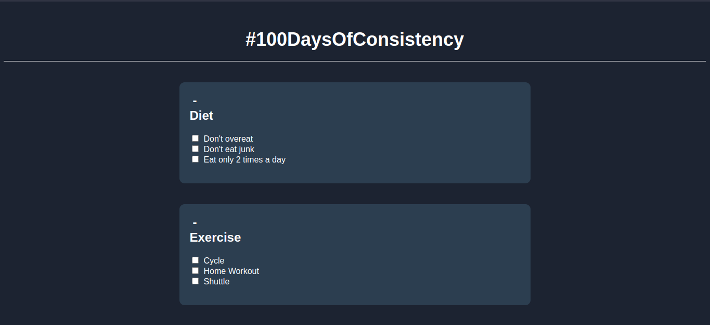
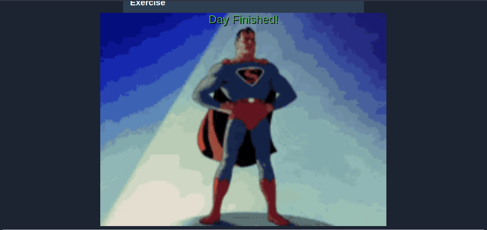

# To-Do List

A simple website built using HTML, CSS, and JavaScript inorder to overcome my Laziness :p

# Screenshot

## When boxes are unchecked.



## When all the boxes are checked.



# Features

* Mark tasks as complete.
* Expand and collapse sections.
* Motivation Superman Gif at the end.

Yep. That's it.

# Getting Started
## Prerequisites

A web browser (e.g., Google Chrome, Mozilla Firefox, Microsoft Edge) 

Duh..? What else did you expect?

## Installation

If you're reading this, You're probably a noob, so

Clone the repository to your local machine:

```sh
git clone https://github.com/shashankfyd/100DaysOf.git
```

Open the To-Do.html file in your web browser.


# Contributing
Contributions are welcome! please open an issue or submit a pull request if i screwed up somewhere.

# License
This project is licensed under the GPL License - see the LICENSE file for details.
